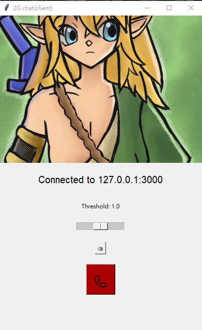

# P2P 2G chat
This is a python program that emulate 2G(Second Generation) mobile communications.
It can simulate the process of making and receiving calls. Because of we don't have a real 2G base
station, so I use socket point to point to transmit voice package.
### Demo

To run this project, open two windows as shown below. The voice transcription program will then begin processing.
<div style="display:flex; text-align=center">


</div>

### execute this project
run Python virtual environment(optional)

```bash
pip3 install virtualenv
virtualenv ven #alter any name you want
# Windows
./ven/Script/activate
# linux
source ven/bin/activate
```

install all package

```bash
pip install -r requirements.txt
```
compile package
```bash
python setup.py build_ext --inplace
```
To run this project, start in server mode first and then switch to client mode. Open two CLI windows to enable communication via the local loopback. Make sure the port numbers match.
```bash
python main.py { server | client }
```
